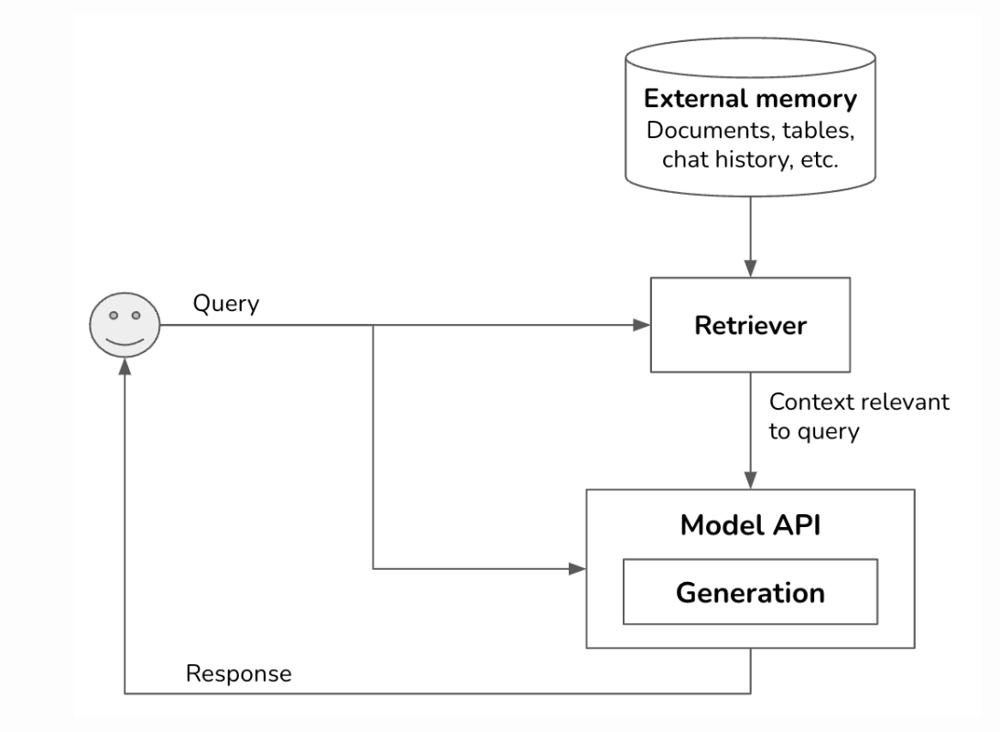
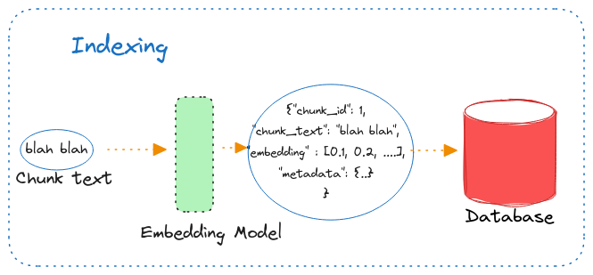
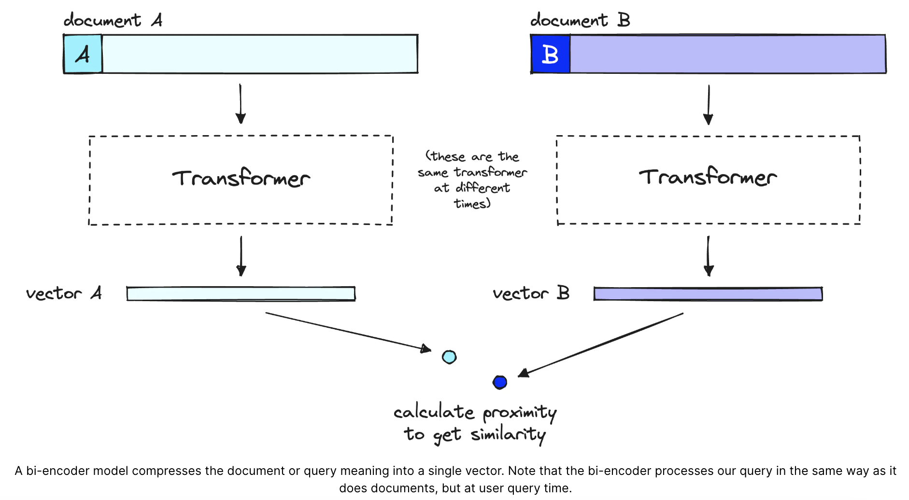
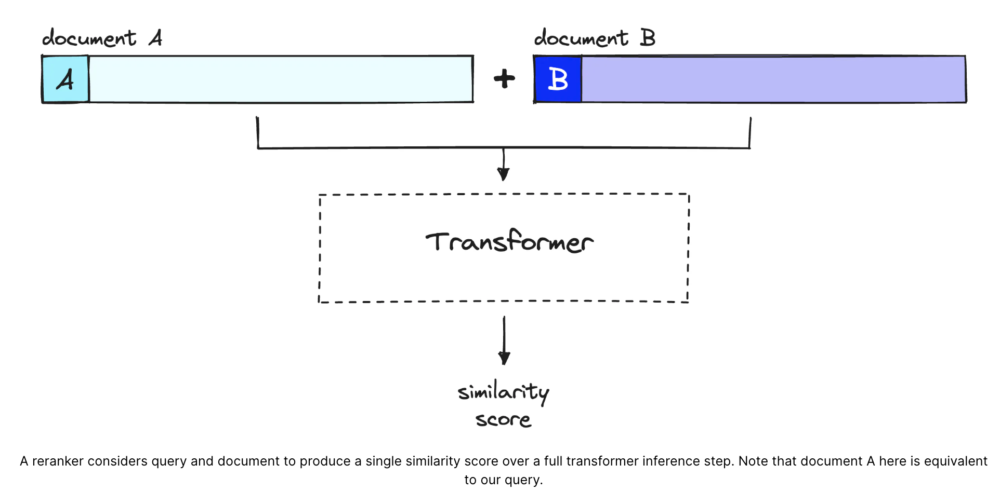

#  L&L Blog Series - RAG Rerank Retrieval

In this project, we will experiment and compare the results of an RAG application with context reranking versus no reranking.

The [experiment notebook](./rag_retrieval_rerank/experiment_rag_retrieval_rerank.ipynb) will guide you through utilising a reranking model to enhance the retrieval steps in our RAG system. It demonstrates how the retrieved contexts are improved compared to using only the cosine distance retrieval technique without reranking.

# &#127939; How do I get started?
If you haven't already done so, please read [DEVELOPMENT.md](DEVELOPMENT.md) for instructions on how to set up your virtual environment using Poetry.

## 💻 Run Locally

> Note: Add a pdf dataset to the [data](rag_search_retrieval/data) folder.

```bash
poetry shell
poetry install
poetry run jupyter notebook
```

Once the notebook is up, make sure you update the `FILE_PATH` parameter value. Once the correct file path is set, click `Run -> Run all cells` option.

It takes about 5 mins for everything to get completed if you have a Nvidia GPU. Otherwise, it will take about ~20-30 minutes.

Jump to the `Comparison` cell and toggle between different dropdown options to compare the results from various approaches.

# 💡 Background

A quick walk through on what the workflow for a Naive RAG system looks like:

<p align="center">
  
</p>


## Data Ingestion

Before we can retrieve the revenant documents from our database, we fist need to store them somewhere (External memory), this step isknown as indexing.

The raw documents are pre-processed, cleaned, and chunked to be indexed into a vector dataset. The text is chunked into smaller texts as it provides the right granularity and keeps the context of the text to be added to LLM limited in length. The quality of index construction determines whether the correct context can be obtained in the retrieval phase.

## RAG Workflow

Once we have completed the indexing phase, a typical RAG workflow looks like the following

1. Input: The user sends an query in the form of any input modality (text, image, video, etc).
2. Retriever: The user query is processed by the retriever to fetch semantically similar documents using a distance metric, such as Cosine distance.
3. Generation: We pass the both the user query and the documents retrieved above to the LLM to get back the response.

Today, we will focus on improving the retriever's ability to fetch semantically similar documents for user queries. We will explore a technique known as reranking to determine if it enhances the relevance of the retrieved documents compared to using only Cosine distance for fetching semantically similar documents based on their distances.

## Indexing - Behind The Scenes

<p align="center">
  
</p>

In our naive RAG model, we process the text chunks through an embedding model to obtain their vector representations. This conversion essentially **compresses** the "meaning" of the text into n-dimensional vectors, which inevitably leading to some information loss.

These vectors enable vector search, allowing us to compare their proximity to a query vector using a similarity metric like Cosine similarity.

|  |
|:--:|
| *Diagram taken from https://www.pinecone.io/learn/series/rag/rerankers* |

Due to this information loss, the top 3 vector search results, for example, may miss some relevant information. This relevant information might be present in other documents within our database, but if they fall below our top_k cutoff, they won't be returned.

## Reranking

Reranking is post-retrieval step. It aims to improve retrieval recall; simply put, the more relevant documents returned, the higher the recall will be.

|  |
|:--:|
| *Diagram taken from https://www.pinecone.io/learn/series/rag/rerankers* |


The process of reranking is as follows:

1. Initial Retrieval: Similar to a naive RAG system, we begin by retrieving documents based on the query. However, instead of limiting the retrieval to just the top 3 documents (a typical example), we expand the number to a larger set, such as the top 25 documents. This expansion aims to increase recall, ensuring we capture more potentially relevant information.

2. Reranking Step: Rather than passing all 25 documents to the Language Model (LLM)—which would decrease its recall and lead to poorer response quality—we introduce a reranking step. In this step, the rerank model evaluates the relevance of each of the 25 documents by comparing their scores against the user's query. From this evaluation, we select only the top 3 highest-scoring documents to pass as context to the LLM.

# Further Reading

- [Lunch & Learn Blog Series - Reranking]()
- [Reranking Research](https://www.notion.so/fuzzylabs/Reranking-04e3f64f27724e51875abd7eb7d97a3c#6f1682a7b243482a8d226f675816851c)
- [Rerankers and Two-Stage Retrieval](https://www.pinecone.io/learn/series/rag/rerankers/)
- [Building A Generative AI Platform](https://huyenchip.com/2024/07/25/genai-platform.html)
